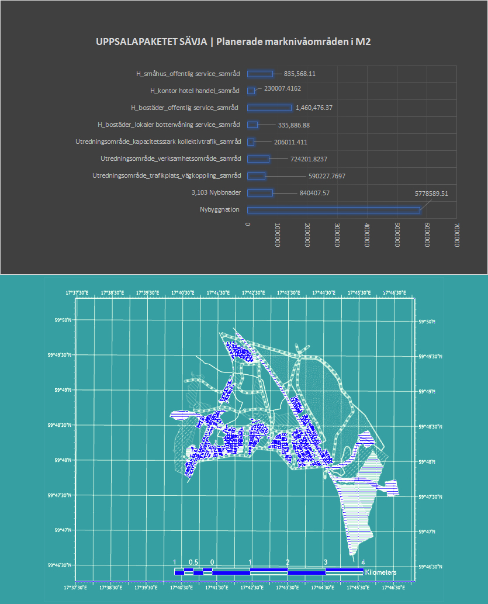

# peoplesEPA | Uppsala 

The GIS data herein is derived from either public documents produced by the Uppsala Kommune (Uppsala.se) or in the case of the number of Green Certified buildings, open access info produced by the Swedish Green Building Council (SCB.se). This is information is of public interest and will be used to test the eCitizenScience, eGov, and PeoplesEPA  tools.

## Getting Started
3D GIS files:
Download GoogleEarth Pro (which is free) to open/view the KML and KMZ files. https://www.google.com/earth/versions/


Database is in html format so you can just open in any browser. You can copy and past anywhere thereafter and in the bottom right there is different tabs to different tables. 

### Prerequisites

To view the GPS data you will need Google Earth Pro or other GIS software. Otherwise there is image file already processed. Such as:
This analysis which shows how the "green paths" conflict with the actual construction, thus the proposed plan has errors which will need to be adjusted (either less green roads, alternative paths, or less buildings). 

This analyses which summarizes the actual areas implicated by the planning; areas which have been missing from the reports. 


### Questions an tests


```
What information is needed to assess the sustainability of a public project? for example the percentage of buildings which are required to be certified and thereafter receive a good rating. 
How can this information be evaluated?

How are public interest being weighted? Who wins and who losses?

Is there enough public (gray, green and social) infrastructure to support the plans + population growth? meaning enough electricity, waste and water management infrastructure; enough school and health-care staff? 

What will be the GHG of the proposed project?


```

## Deployment

A demo of a integrated system, making use of this data will be hopefully launched in the iOs and Google stores (for free) during Uppsala Climate Week.


## Authors

See the list of [contributors](https://github.com/EthosandLelou/peoplesEPA/contributors) who participated in this project.

## License

Data Sources for GIS plans Uppalapaketet by Uppsala Municiality 2020 https://bygg.uppsala.se/samhallsbyggnad-utveckling/uppsalapaketet/ https://bygg.uppsala.se/planerade-omraden/sydostra-stadsdelarna/kartor-i-3d/

Data source of green certified buildings in Sweden and Uppsala, Green Building Council ( data accessed 2020 via https://www.sgbc.se/statistik/ and thereafter: "These statistics are based on the information provided by certifying property owners. We reserve the right to make any errors, in accordance with clause 18 of our terms of use https://www.sgbc.se/anvaendaravtal. If you discover errors, please email the respective certification system's inbox or to the office. Contact information can be found here https://www.sgbc.se/kontakt.")  

